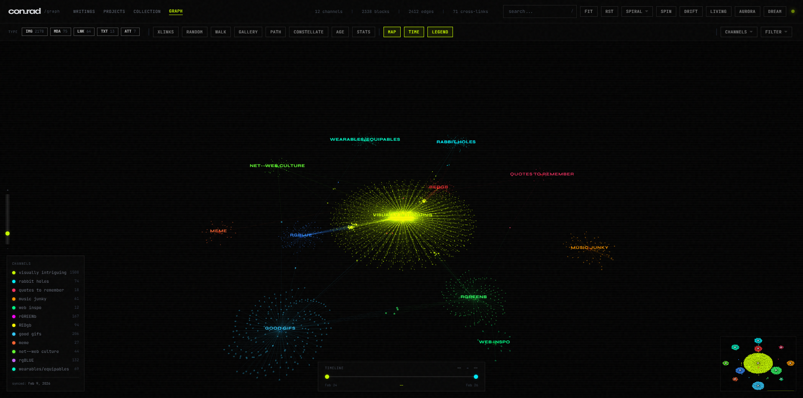
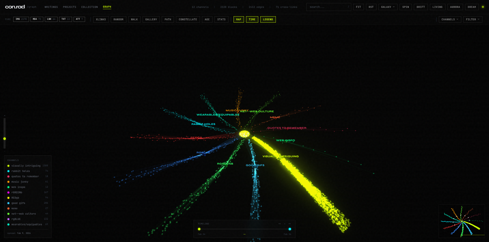
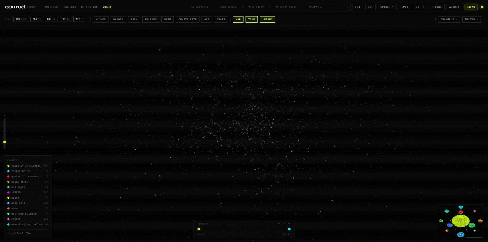

# arena-3d

3D graph visualization for [Are.na](https://www.are.na) channels and blocks. Plug in your Are.na username, fetch your data, and explore your entire collection as a navigable WebGL scene with particle modes, GPU shaders, and bloom.

Built on Three.js with GLSL shaders, InstancedMesh rendering, and a full post processing pipeline. Originally made for my own Are.na at [nemocake.github.io/website/graph](https://nemocake.github.io/website/graph/index.html), now open for anyone to use.





## Setup

```bash
git clone https://github.com/nemocake/arena-graph.git
cd arena-3d
npm install
npm run setup
npm run dev
```

The setup wizard asks for your Are.na username or channel URLs, your API token, then fetches your data and generates a config file. That's it.

You'll need a free Are.na API token. See [docs/TOKEN-GUIDE.md](docs/TOKEN-GUIDE.md) for a quick walkthrough, or grab one at [dev.are.na/oauth/applications](https://dev.are.na/oauth/applications).

If you'd rather skip the wizard, copy the example config and edit it yourself:

```bash
cp config/arena-3d.config.example.js config/arena-3d.config.js
```

```js
export default {
  arena: {
    username: 'your-arena-username',
    token: 'your-api-token',  // required — see docs/TOKEN-GUIDE.md
  },
};
```

Then fetch and run:

```bash
npm run fetch
npm run dev
```

Get an API token at [dev.are.na/oauth/applications](https://dev.are.na/oauth/applications). Required for fetching by username, recommended for channel URLs. Free to create — see [docs/TOKEN-GUIDE.md](docs/TOKEN-GUIDE.md) for a step-by-step guide.

## What it does

Fetches every channel and block from an Are.na account via the API, builds a graph data file, and renders a full 3D visualization with:

- **Three.js/WebGL rendering** with InstancedMesh for thousands of nodes in a single draw call, GLSL shaders with emissive glow
- **4 layout modes** (spiral, galaxy, sphere, head wireframe) with animated transitions between them
- **5 particle modes** (dream, cosmos, nebula, living, aurora) all running on the GPU
- **Post processing** with bloom, afterimage trails, CRT scanlines, vignette, exponential fog
- **GPU picking** for O(1) hover detection via offscreen color ID render
- **Search** with prefix matching across a pre built index
- **Gallery** grid view of visible blocks, sortable by date/name/connections
- **Pathfinder** shortest path between any two blocks via BFS
- **Constellation mode** dashed edges between blocks sharing auto detected tags
- **Category filter** by artist, medium, theme, or source
- **Channel filter** toggle individual channels on/off
- **Age heatmap** color nodes by creation date, blue to red gradient
- **Timeline scrubber** dual range slider to filter by date
- **Stats panel** type distribution, top tags, monthly histogram
- **Minimap** 2D canvas overlay showing camera viewport
- **Random walk** auto navigate through connected blocks
- **Keyboard navigation** arrow keys between neighbors

## Layouts

**Spiral** is the default. Your largest channel sits at the center, everything else spirals out in golden angle spacing on an outer ring. Each block orbits its parent channel.

**Galaxy** arranges channels as logarithmic spiral arms emanating from a dense core of cross linked blocks.

**Sphere** distributes everything on a Fibonacci sphere surface.

**Head** maps blocks onto a 3D wireframe skull and brain model. Toggle skull and brain meshes independently.

## Particle modes

**Dream** dissolves the graph into 4000 particles flowing through curl noise fields. Afterimage trails create motion blur. Pairs with Aurora for color modulation.

**Cosmos** builds a rotating spiral galaxy. Keplerian orbits, polar jets, supernova pulses every 12 seconds with bloom surges. Diffraction spike fragment shader on every particle.

**Nebula** is an interactive 3D cloud. Move your mouse and particles repel away from the cursor like magnetic repulsion. Pushed particles warm in color, mouse velocity creates a wake effect. Soft gaussian glow for a volumetric look.

**Living** makes the graph breathe. Nodes oscillate in scale and drift with layered sine waves, each on its own phase.

**Aurora** sends color waves flowing across all nodes. 5 wave modes (waves, chase, pulse, twinkle, rain), 7 presets (aurora, christmas, ocean, sunset, neon, mono, custom), sliders for speed, brightness, spread, and bloom. Full custom color picker.

**Drift** auto orbits the camera while morphing between all four layouts. Stops on any user interaction.

## FX Panel

The **FX** dropdown in the header exposes full control over the rendering pipeline. Every parameter updates in real-time.

**Overlays** — toggle Living (breathing nodes) and Aurora (color waves) independently. These layer on top of any active view mode.

**Bloom** — three sliders for strength, radius, and threshold. Crank strength for a blown-out neon look, or lower the threshold to make dimmer nodes glow.

**Trails** — toggle afterimage on/off and control persistence. Higher persist values leave longer motion ghosts — works especially well with Spin or Drift.

**Screen** — toggle CRT scanlines, adjust scanline intensity, and control vignette (edge darkening). Push vignette high for a dramatic tunnel effect.

**Scene** — exposure controls overall brightness via tone mapping. Fog controls distance fade (higher = more fog, tighter atmosphere). Edge opacity controls how visible the connection lines between nodes are.

**Color** — full color grading. Hue rotates the entire color spectrum. Saturation goes from grayscale (0) through normal (1) to hyper-vivid (3). Temperature shifts warm (amber) or cool (blue). Invert flips to a full negative.

All FX combine freely — Dream mode + Aurora overlay + high bloom + hue shift + scanlines all work together.

## Filtering

The filter menu builds itself from your data. Whatever categories the auto-tagger finds become tabs in the filter dropdown — no setup required. If your blocks have artist names, you get an artist filter. If they have medium keywords, you get a medium filter. And so on.

The type pills (IMG, LNK, TXT, etc.) also generate dynamically based on what block types exist in your collection.

## How auto-tagging works

The fetch script scans every block's title and description to extract filter categories. No AI or ML — just pattern matching. Here's exactly how each category is detected:

**Artists** — If a block title contains a separator (`, ` or ` — ` or ` - `), the text before the separator is treated as a name. If that same name appears on 2 or more blocks, it becomes an artist tag.

```
Yayoi Kusama, Infinity Nets        → artist: yayoi-kusama
Anni Albers — Study for a Rug      → artist: anni-albers
```

Titles that are just filenames (like `IMG_2034.jpg`) are ignored.

**Mediums** — Block titles and descriptions are scanned for material keywords. Current list includes: paper, ink, acrylic, canvas, oil, pencil, digital, collage, textile, video, ceramic, glass, bronze, watercolor, charcoal, lithograph, woodcut, silkscreen, embroidery, photograph, neon, wire, steel, wood, fabric, thread, and more (~45 keywords).

**Themes** — Same keyword scan for conceptual terms: grid, geometric, generative, abstract, pattern, architecture, typography, algorithmic, minimal, kinetic, optical, landscape, portrait, nature, rhythm, noise, color, space, time, movement, texture, and more (~27 keywords).

**Sources** — If 5 or more blocks link to the same domain (like youtube.com or instagram.com), that domain becomes a source filter.

### Getting better filters

The auto-tagger works best when your blocks have descriptive titles. A few tips:

- **Name your blocks** `Artist Name, Work Title` or `Artist Name — Description` to get artist detection
- **Add descriptions** with material or theme words and they'll be picked up automatically
- **Consistent naming** helps — the same artist name needs to appear on at least 2 blocks to register
- Blocks with generic filenames (`screenshot_2024.png`) won't generate any tags

See [docs/TAGGING-GUIDE.md](docs/TAGGING-GUIDE.md) for the full keyword list.

## Configuration

Everything lives in `config/arena-3d.config.js`. The main options:

| Option | What it does | Default |
|--------|-------------|---------|
| `arena.username` | Are.na username slug | |
| `arena.channels` | Specific channel slugs or URLs | `[]` |
| `arena.token` | API access token | |
| `display.title` | Header title | `arena-3d` |
| `display.accentColor` | UI accent color | `#ccff00` |
| `graph.centerChannel` | Which channel sits at center | auto (largest) |
| `graph.colorPalette` | Custom hex array for channel colors | 12 color neon palette |
| `graph.colorOverrides` | Per channel color overrides by slug | `{}` |
| `graph.defaultLayout` | Starting layout | `spiral` |

## CLI

```bash
npm run fetch -- --username john-doe
npm run fetch -- --channels slug1,slug2
npm run fetch -- --token YOUR_TOKEN
npm run fetch -- --fresh  # ignore cache, re fetch everything

# python alternative
python3 scripts/fetch-arena.py --username john-doe --token YOUR_TOKEN
```

## Project structure

```
config/
  arena-3d.config.js          your config (gitignored)
  arena-3d.config.example.js  template
  default.config.js           default values
scripts/
  setup.js                    interactive setup wizard
  fetch.js                    Node.js data fetcher
  fetch-arena.py              Python data fetcher (alternative)
data/
  arena-graph.json            generated graph data (gitignored)
src/
  main.js                     boot sequence, wires all systems together
  constants.js                palette, layout params, rendering thresholds
  config/ConfigLoader.js      loads and merges user config
  state/AppState.js           reactive state management
  core/                       SceneManager, CameraController, PostProcessing
  graph/                      NodeRenderer, EdgeRenderer, ConstellationRenderer, GraphData
  layout/                     SpiralLayout, GalaxyLayout, SphereLayout, HeadLayout, LayoutEngine
  interaction/                Raycaster, TooltipManager, SelectionManager, KeyboardNav
  features/                   all visual modes + search, filter, gallery, pathfinder, etc.
  shaders/                    GLSL vertex/fragment shaders
  styles/main.css             glass panels, scrollbars, overlays
```

## Build

```bash
npm run build    # production build to dist/
npm run preview  # preview it locally
```

## Roadmap

- [ ] Hosted web version (paste your Are.na URL, see your graph instantly)
- [ ] Thumbnail textures on close zoom
- [ ] Performance LOD at distance
- [ ] Are.na partnership for better API access
- [ ] Real time updates when blocks are added

## License

MIT
